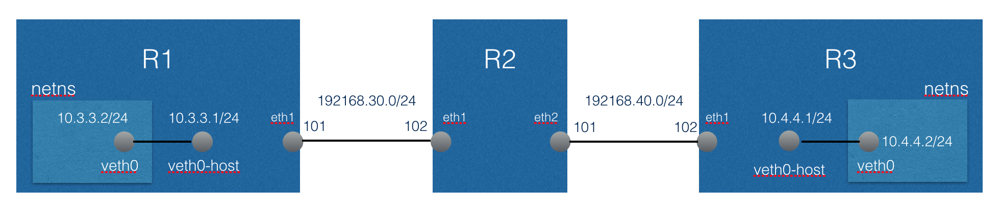

# Linux MPLS調査

### 構成

以下の構成にて、一方のnamespaceからもう一方のnamespaceにpingが飛ばせるか調査した。
- Ubuntu 14.04.3 Server 64bit
- kernel version 4.4.0



- r1
 - eth1: 192.168.30.101

- r2
 - eth1: 192.168.30.102
 - eth2: 192.168.40.101

- r3
 - eth1: 192.168.40.102

### 事前準備(mpls関連モジュール)

mpls関連モジュールの事前準備として以下を実施
- light weight tunnel, mpls-iptunnel, mpls-gso, mpls-routerを有効にして[カーネル4.4](https://cdn.kernel.org/pub/linux/kernel/v4.x/linux-4.4.tar.xz)をコンパイル
- コンパイルしたカーネルパッケージを上記r1, r2, r3にインストール

```bash
sudo su -
apt-get install git fakeroot build-essential ncurses-dev xz-utils libssl-dev bc
apt-get install kernel-package
wget https://cdn.kernel.org/pub/linux/kernel/v4.x/linux-4.4.tar.xz
tar xvf linux-4.4.tar.xz
cd linux-4.4
cp /boot/config-$(uname -r) .config
make menuconfig
# lwtunnel, mpls-iptunnel, mpls-gso, and mpls-routerを有効化
make-kpkg clean
fakeroot make-kpkg --initrd --revision=1.0.MPLS kernel_image kernel_headers -j 8
cd ..
dpkg -i linux-headers-4.4.0_1.0.MPLS_amd64.deb
dpkg -i linux-image-4.4.0_1.0.MPLS_amd64.deb
```

### 事前準備(iproute2)

mplsに対応したipコマンドをコンパイルし、r1, r2, r3にインストール

```bash
sudo su -
apt-get install git build-essential flex bison iptables-dev -y
git clone git://git.kernel.org/pub/scm/linux/kernel/git/shemminger/iproute2.git
cd iproute2
git checkout -b v4.4.0 v4.4.0
./configure
make
make install
```

## モジュールのロード、パラメータの設定
- r1, r2, r3それぞれで以下を実行
```bash
sudo su -
modprobe mpls_router
modprobe mpls_gso
modprobe mpls_iptunnel
sysctl -w net.mpls.platform_labels=1048575
```

## r1での設定

- (outgoing) 10.4.4.0/24宛てのパケットはラベル100のMPLSパケットとして送信
- (incoming) ラベル210を持つMPLSパケットはラベルをはがして、10.3.3.2に転送

```bash
sudo su -
ip netns add host1
ip link add veth0 type veth peer name veth0-host
ip link set veth0 netns host1
ifconfig veth0-host 10.3.3.1/24 up
ip netns exec host1 ifconfig veth0 10.3.3.2/24 up
ip netns exec host1 ip route add 10.4.4.0/24 via 10.3.3.1 dev veth0
# MPLS outgoing
ip route add 10.4.4.0/24 encap mpls 100 via inet 192.168.30.102
# MPLS incoming
sysctl -w net.mpls.conf.eth1.input=1
ip -f mpls route add 210 via inet 10.3.3.2 dev veth0-host
# ipv4 forwarding
sysctl -w net.ipv4.ip_forward=1
```


## r2での設定

- (r1 -> r3) ラベル100を持つMPLSパケットはラベル110のMPLSパケットとして192.168.40.102に送信
- (r3 -> r1) ラベル200を持つMPLSパケットはラベル210のMPLSパケットとして192.168.30.101に送信

```bash
sudo su -
sysctl -w net.mpls.conf.eth1.input=1
sysctl -w net.mpls.conf.eth2.input=1
ip -f mpls route add 100 as 110 via inet 192.168.40.102
ip -f mpls route add 200 as 210 via inet 192.168.30.101
```


## r3での設定

- (outgoing) 10.3.3.0/24宛てのパケットはラベル200のMPLSパケットとして送信
- (incoming) ラベル110を持つMPLSパケットはラベルをはがして、10.4.4.2に転送

-
```bash
sudo su -
ip netns add host2
ip link add veth0 type veth peer name veth0-host
ip link set veth0 netns host2
ifconfig veth0-host 10.4.4.1/24 up
ip netns exec host2 ifconfig veth0 10.4.4.2/24 up
ip netns exec host2 ip route add 10.3.3.0/24 via 10.4.4.1 dev veth0
# MPLS outgoing
ip route add 10.3.3.0/24 encap mpls 200 via inet 192.168.40.101
# MPLS incoming
sysctl -w net.mpls.conf.eth1.input=1
ip -f mpls route add 110 via inet 10.4.4.2 dev veth0-host
# ipv4 forwarding
sysctl -w net.ipv4.ip_forward=1
```


## 動作確認

### r1内のnamespace host1から10.4.4.2あてにping


```bash
# ip netns exec host1 ping -c 1 10.4.4.2
PING 10.4.4.2 (10.4.4.2) 56(84) bytes of data.
64 bytes from 10.4.4.2: icmp_seq=1 ttl=61 time=2.09 ms

--- 10.4.4.2 ping statistics ---
1 packets transmitted, 1 received, 0% packet loss, time 0ms
rtt min/avg/max/mdev = 2.092/2.092/2.092/0.000 ms
```

- tcpdump eth1

```bash
# tcpdump -envi eth1
tcpdump: listening on eth1, link-type EN10MB (Ethernet), capture size 65535 bytes
21:29:35.448314 08:00:27:55:c1:95 > 08:00:27:ce:bd:53, ethertype MPLS unicast (0x8847), length 102: MPLS (label 100, exp 0, [S], ttl 63)
	(tos 0x0, ttl 63, id 50854, offset 0, flags [DF], proto ICMP (1), length 84)
    10.3.3.2 > 10.4.4.2: ICMP echo request, id 1501, seq 1, length 64
21:29:35.450191 08:00:27:ce:bd:53 > 08:00:27:55:c1:95, ethertype MPLS unicast (0x8847), length 102: MPLS (label 210, exp 0, [S], ttl 62)
	(tos 0x0, ttl 63, id 25441, offset 0, flags [none], proto ICMP (1), length 84)
    10.4.4.2 > 10.3.3.2: ICMP echo reply, id 1501, seq 1, length 64
```

### r2にてパケット確認

- tcpdump eth1

```bash
# tcpdump -envi eth1
tcpdump: listening on eth1, link-type EN10MB (Ethernet), capture size 65535 bytes
21:29:35.451009 08:00:27:55:c1:95 > 08:00:27:ce:bd:53, ethertype MPLS unicast (0x8847), length 102: MPLS (label 100, exp 0, [S], ttl 63)
	(tos 0x0, ttl 63, id 50854, offset 0, flags [DF], proto ICMP (1), length 84)
    10.3.3.2 > 10.4.4.2: ICMP echo request, id 1501, seq 1, length 64
21:29:35.452084 08:00:27:ce:bd:53 > 08:00:27:55:c1:95, ethertype MPLS unicast (0x8847), length 102: MPLS (label 210, exp 0, [S], ttl 62)
	(tos 0x0, ttl 63, id 25441, offset 0, flags [none], proto ICMP (1), length 84)
    10.4.4.2 > 10.3.3.2: ICMP echo reply, id 1501, seq 1, length 64

```

- tcpdump eth2

```bash
# tcpdump -envi eth2
tcpdump: listening on eth2, link-type EN10MB (Ethernet), capture size 65535 bytes
21:29:35.451020 08:00:27:83:75:1a > 08:00:27:94:ff:6f, ethertype MPLS unicast (0x8847), length 102: MPLS (label 110, exp 0, [S], ttl 62)
	(tos 0x0, ttl 63, id 50854, offset 0, flags [DF], proto ICMP (1), length 84)
    10.3.3.2 > 10.4.4.2: ICMP echo request, id 1501, seq 1, length 64
21:29:35.452072 08:00:27:94:ff:6f > 08:00:27:83:75:1a, ethertype MPLS unicast (0x8847), length 102: MPLS (label 200, exp 0, [S], ttl 63)
	(tos 0x0, ttl 63, id 25441, offset 0, flags [none], proto ICMP (1), length 84)
    10.4.4.2 > 10.3.3.2: ICMP echo reply, id 1501, seq 1, length 64

```


### r3にてパケット確認

- tcpdump eth1

```bash
# tcpdump -envi eth1
tcpdump: listening on eth1, link-type EN10MB (Ethernet), capture size 65535 bytes
21:29:35.451689 08:00:27:83:75:1a > 08:00:27:94:ff:6f, ethertype MPLS unicast (0x8847), length 102: MPLS (label 110, exp 0, [S], ttl 62)
	(tos 0x0, ttl 63, id 50854, offset 0, flags [DF], proto ICMP (1), length 84)
    10.3.3.2 > 10.4.4.2: ICMP echo request, id 1501, seq 1, length 64
21:29:35.451910 08:00:27:94:ff:6f > 08:00:27:83:75:1a, ethertype MPLS unicast (0x8847), length 102: MPLS (label 200, exp 0, [S], ttl 63)
	(tos 0x0, ttl 63, id 25441, offset 0, flags [none], proto ICMP (1), length 84)
    10.4.4.2 > 10.3.3.2: ICMP echo reply, id 1501, seq 1, length 64
```

- r3内のnamespace host2にてパケット確認

```bash
# ip netns exec host2 tcpdump -envi veth0
tcpdump: listening on veth0, link-type EN10MB (Ethernet), capture size 65535 bytes
21:29:35.451700 62:ef:30:16:61:d5 > 0a:4a:a5:44:4c:88, ethertype IPv4 (0x0800), length 98: (tos 0x0, ttl 61, id 50854, offset 0, flags [DF], proto ICMP (1), length 84)
    10.3.3.2 > 10.4.4.2: ICMP echo request, id 1501, seq 1, length 64
21:29:35.451899 0a:4a:a5:44:4c:88 > 62:ef:30:16:61:d5, ethertype IPv4 (0x0800), length 98: (tos 0x0, ttl 64, id 25441, offset 0, flags [none], proto ICMP (1), length 84)
    10.4.4.2 > 10.3.3.2: ICMP echo reply, id 1501, seq 1, length 64
```
